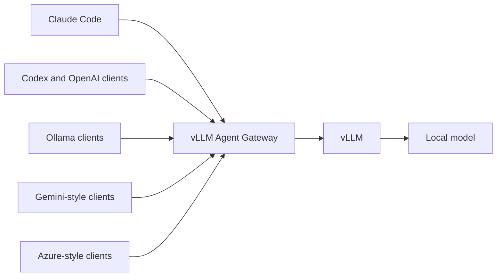

# vLLM Agent Gateway

A Linux-first, multi-protocol compatibility gateway for a local [vLLM](https://github.com/vllm-project/vllm) server.

It lets agent clients use one local model through OpenAI Chat/Responses, Anthropic Messages, Ollama, Gemini-style, and Azure OpenAI-style APIs. It also normalizes tool calls and thinking controls, routes model aliases, and turns PDF inputs into text or page images that multimodal models can consume.

> Status: alpha. The project is intended for local and private-network deployments. It is not a drop-in replacement for every cloud-provider feature.

## Why

Agent clients frequently speak different API dialects even when they ultimately need the same operations: chat, streaming, tool calls, images, documents, and reasoning. vLLM implements the most important native APIs, while this gateway fills practical client-compatibility gaps without placing tool execution inside the model server.



## Supported surfaces

| Client/API family | Endpoints and behavior |
|---|---|
| OpenAI | `/v1/chat/completions`, `/v1/completions`, `/v1/responses`, model aliases, CORS |
| Anthropic | `/v1/messages`, `/v1/messages/count_tokens`, thinking, tool history, PDF blocks |
| Ollama | `/api/chat`, `/api/generate`, tags/show/ps/version, NDJSON streaming |
| Gemini-style | model list, `generateContent`, `streamGenerateContent`, `countTokens`, function calls |
| Azure OpenAI-style | `/openai/deployments/{deployment}/chat/completions`, completions, responses |
| Documents | searchable PDF to text; scanned PDF pages to JPEG; plain-text attachments |

All requested model IDs are routed to `SERVED_MODEL`. This allows clients that insist on names such as `gpt-*`, `claude-*`, deployment IDs, or Ollama tags to share one local backend.

## Quick start: existing vLLM server

Requirements: Python 3.11+ and a reachable vLLM OpenAI server.

```bash
python -m venv .venv
source .venv/bin/activate
pip install -e .

export VLLM_UPSTREAM=http://127.0.0.1:8001
export SERVED_MODEL=my-local-model
export MODEL_CONTEXT_LENGTH=32768
export GATEWAY_API_KEYS=change-me

vllm-agent-gateway
```

The gateway listens on `http://0.0.0.0:8000` by default.

```bash
curl http://127.0.0.1:8000/healthz
curl http://127.0.0.1:8000/v1/models \
  -H 'Authorization: Bearer change-me'
```

## Quick start: Docker Compose on Linux

Docker, the NVIDIA Container Toolkit, and a local model directory are required.

```bash
cp .env.example .env
```

Edit at least:

```dotenv
MODEL_PATH=/srv/models/my-model
SERVED_MODEL=my-local-model
MODEL_CONTEXT_LENGTH=32768
GATEWAY_API_KEYS=replace-with-a-random-secret
TOOL_CALL_PARSER=hermes
```

Then start both vLLM and the gateway:

```bash
docker compose up -d --build
docker compose ps
curl http://127.0.0.1:8000/healthz
```

Parser flags are model-specific. Change `TOOL_CALL_PARSER` for your model. If your model needs a reasoning parser, extend the vLLM command in `compose.yaml` with its supported `--reasoning-parser` value.

## Client configuration

### Claude Code

```bash
export ANTHROPIC_BASE_URL=http://127.0.0.1:8000
export ANTHROPIC_AUTH_TOKEN=change-me
export ANTHROPIC_MODEL=my-local-model
export ANTHROPIC_DEFAULT_OPUS_MODEL=my-local-model
export ANTHROPIC_DEFAULT_SONNET_MODEL=my-local-model
export ANTHROPIC_DEFAULT_HAIKU_MODEL=my-local-model
claude
```

### Codex

```toml
model = "my-local-model"
model_provider = "local_vllm"
model_context_window = 32768

[model_providers.local_vllm]
name = "Local vLLM Agent Gateway"
base_url = "http://127.0.0.1:8000/v1"
env_key = "LOCAL_LLM_API_KEY"
wire_api = "responses"
```

```bash
export LOCAL_LLM_API_KEY=change-me
codex
```

### OpenAI-compatible clients

```text
Base URL: http://127.0.0.1:8000/v1
API key:  change-me
Model:    my-local-model
```

### Ollama-compatible clients

Point the client at `http://127.0.0.1:8000`. If authentication is enabled, the client must support an `Authorization: Bearer` or `X-Api-Key` header. The stock Ollama CLI does not provide a general custom-header option, so use a private network/reverse proxy policy or disable gateway keys only for a strictly local Ollama-only deployment.

## Dynamic thinking

The gateway maps client-native controls per request; no vLLM restart is needed.

| API | Control |
|---|---|
| Anthropic | `thinking.type = enabled`, `adaptive`, or `disabled` |
| OpenAI Chat | `reasoning_effort` |
| OpenAI Responses | `reasoning.effort` (handled by vLLM) |
| Ollama | `think: true` or `false` |
| Gemini-style | `generationConfig.thinkingConfig` |

The model's chat template and configured vLLM reasoning parser still determine whether reasoning is emitted correctly.

## PDF compatibility

Anthropic document blocks and OpenAI file/input-file parts accept:

- base64 PDF data;
- PDF data URLs;
- public HTTP(S) PDF URLs;
- base64 UTF-8 plain text.

Searchable pages are extracted as text. Pages without meaningful text are rendered as JPEG images. Public URL loading rejects credentials, non-HTTP schemes, unusual ports, internal hostnames, and non-public resolved addresses to reduce SSRF risk.

Default limits are 50 MiB, 64 pages, 24 rendered scan pages, and 500,000 extracted characters. All are configurable through environment variables.

## Authentication and deployment safety

Set `GATEWAY_API_KEYS` to a comma-separated list. When non-empty, the gateway accepts:

- `Authorization: Bearer <key>`;
- `X-Api-Key: <key>`;
- Azure's `Api-Key: <key>` and Gemini's `X-Goog-Api-Key: <key>`;
- Gemini's `?key=<key>` query parameter.

Health endpoints remain unauthenticated. An empty `GATEWAY_API_KEYS` intentionally disables application-layer authentication for local development.

For shared deployments:

- terminate TLS at a private ingress or reverse proxy;
- restrict CORS and trusted hosts;
- protect `/metrics` and model-discovery endpoints;
- apply rate limits and per-user quotas at the ingress;
- keep tool execution in a sandboxed agent with allowlists and approval rules;
- monitor the vLLM `/metrics` endpoint for queueing, latency, KV-cache pressure, and failures.

See [SECURITY.md](SECURITY.md).

## Intentional limits

- No cloud Files API. Send PDF/plain text inline or by public URL.
- No embeddings endpoint for a generative-only model.
- No built-in web search, code execution, or MCP server. Those are client/agent responsibilities.
- No audio transcription or video decoding. Preprocess them with dedicated models/tools.
- Gemini compatibility covers common generation, one-event streaming, counting, and function calls—not Google Files, grounding, caching, or Vertex IAM.
- Authentication is intentionally small and in-process; production multi-tenant identity, quotas, and audit generally belong at an API gateway or ingress.

## Development

```bash
python -m pip install -e ".[dev]"
ruff check .
pytest -q
```

The test suite exercises protocol transformations without requiring a GPU or running model.

## License

MIT
