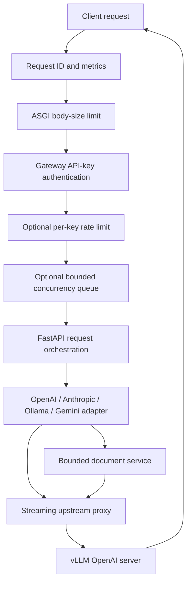

# Architecture

## Overview

v0.2 replaces the original single-file implementation with small modules that
separate protocol translation, security controls, document conversion,
observability, and upstream streaming.



Inexpensive root, health, and gateway-metrics paths bypass the optional request
concurrency and rate limiters. Gateway metrics still require authentication
when `GATEWAY_API_KEYS` is configured.

## Module map

| Module | Responsibility |
|---|---|
| `app.py` | ASGI entry point and compatibility facade for v0.1 helper imports |
| `application.py` | `create_app`, route orchestration, lifespan-owned HTTP client, middleware assembly |
| `config.py` | Immutable environment-derived settings |
| `adapters/` | Protocol/path conversion for OpenAI, Anthropic, Ollama, Gemini, and Azure-style routes |
| `adapters/gemini_stream.py` | Fragment-tolerant OpenAI SSE parser and incremental Gemini stream framing |
| `documents/loader.py` | Bounded plain/base64/URL source loading |
| `documents/pdf.py` | Searchable-page extraction and bounded scanned-page rendering |
| `documents/url_security.py` | Deny/allowlist URL policy, DNS checks, redirects, peer-IP checks, bounded fetch |
| `document_service.py` | PDF worker capacity limit and end-to-end conversion timeout |
| `middleware/` | Authentication, actual-body-size enforcement, request IDs, queueing, rate limiting |
| `proxy/upstream.py` | Credential stripping, upstream credential injection, and response forwarding |
| `proxy/streaming.py` | Cancellation-shielded upstream close across ASGI disconnect/error paths |
| `observability/` | Dependency-free Prometheus registry and request metrics |
| `errors.py` | Protocol-neutral gateway errors |

## Protocol request flow

1. Request middleware assigns `X-Request-ID`, observes duration, enforces the
   received body limit, authenticates the client, and applies optional
   per-process admission controls.
2. Azure deployment-prefixed paths are normalized before upstream forwarding.
3. The relevant adapter maps model aliases to `SERVED_MODEL` and translates
   client-specific content, thinking, and tool fields.
4. PDF/plain-text inputs pass through `DocumentService`. Source loading is
   asynchronous; CPU-bound parsing/rendering runs in a worker thread under a
   capacity limiter and timeout.
5. Client credentials are removed. `VLLM_UPSTREAM_API_KEY`, when set, is added
   only for the vLLM hop.
6. Non-Gemini protocol responses stream from vLLM without full buffering.
   Gemini `streamGenerateContent` incrementally converts upstream OpenAI SSE to
   Gemini SSE or a streaming JSON array.
7. A client cancellation unwinds the response iterator and closes the upstream
   response.

## Application construction

New integrations should use:

```python
from vllm_agent_gateway.application import create_app
from vllm_agent_gateway.config import Settings

config = Settings.from_env()
app = create_app(config)
```

`create_app` accepts an optional `httpx.AsyncBaseTransport`, which keeps
upstream integration tests deterministic without a running vLLM instance.

`vllm_agent_gateway.app:app` remains the CLI/default ASGI target. Legacy
underscored synchronous helpers are compatibility-only; asynchronous callers
should use adapters and document services directly.

## State and scaling

The shared `httpx.AsyncClient`, document service, metric registry, concurrency
limiter, and rate-limit buckets live inside one process. Starting multiple
workers creates independent pools, queues, counters, and rate-limit state.

For more than one process or host:

- enforce global admission and quotas at an ingress or shared rate-limit service;
- scrape and aggregate metrics from every process;
- size each process's upstream pool and document workers independently;
- do not assume a configured process-local limit is a cluster-wide limit.

## Compatibility boundary

The gateway translates common client workflows; it does not recreate cloud
control planes. Files APIs, Vertex IAM, cached content, hosted grounding, cloud
safety services, account management, billing, and tool execution are outside
its scope.
