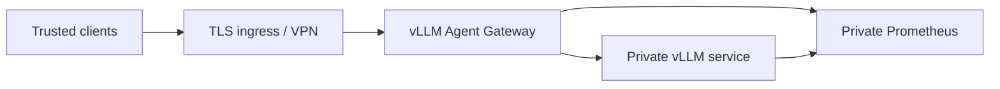

# Production safety boundaries

This gateway is suitable for a trusted local/private deployment when its
boundaries are understood. It is not a public multi-tenant control plane.

## Recommended topology



Only the ingress should be reachable by clients. Keep vLLM on a private
container/network address and apply egress rules to the gateway. The supplied
Compose file publishes only the gateway port and exposes vLLM internally, but
it does not configure TLS, a firewall, CPU/memory limits, or log redaction.

The gateway container runs as an unprivileged user. Its Compose service uses a
read-only root filesystem, a bounded temporary filesystem, dropped Linux
capabilities, `no-new-privileges`, an init process, and a PID limit. Preserve
these controls in derived deployments.

The vLLM service uses `ipc: host` in the supplied Compose file for GPU workload
compatibility/performance. This reduces IPC namespace isolation; assess that
tradeoff for the host's threat model.

## Single-32-GiB-GPU starting profile

Use these as starting values, not performance guarantees:

```dotenv
MAX_NUM_SEQS=2
GATEWAY_MAX_INFLIGHT=2
GATEWAY_MAX_QUEUE_SIZE=8
GATEWAY_QUEUE_TIMEOUT_SECONDS=30
PDF_CONVERSION_CONCURRENCY=2
PDF_CONVERSION_TIMEOUT_SECONDS=60
```

`MAX_NUM_SEQS` controls backend scheduling. `GATEWAY_MAX_INFLIGHT` controls
expensive HTTP requests admitted to one gateway process. They are related but
not identical. Long prompts, long outputs, vision inputs, and model KV-cache
requirements can make `1` the correct setting. Measure TTFT, end-to-end P95,
queue wait, GPU memory, and cancellation cleanup before increasing either.

Keep the queue small. A large queue increases memory and client wait time but
does not increase inference throughput.

## Hardened environment baseline

```dotenv
GATEWAY_API_KEYS=replace-with-long-random-key
VLLM_UPSTREAM_API_KEY=replace-with-a-different-private-key
GATEWAY_CORS_ORIGINS=https://trusted-client.example
GATEWAY_TRUSTED_HOSTS=gateway.internal.example
GATEWAY_MAX_REQUEST_BYTES=74099371
GATEWAY_MAX_INFLIGHT=2
GATEWAY_MAX_QUEUE_SIZE=8
GATEWAY_QUEUE_TIMEOUT_SECONDS=30
GATEWAY_REQUESTS_PER_MINUTE=60
GATEWAY_RATE_LIMIT_BURST=10
GATEWAY_METRICS_ENABLED=true
DOCUMENT_URL_POLICY=deny
DOCUMENT_ALLOWED_HOSTS=
DOCUMENT_EXTRA_ALLOWED_NETWORKS=
```

Use secrets management rather than committing real values to `.env`. The
gateway key and upstream key serve different trust boundaries and should never
be the same credential.

## Public and protected endpoints

When gateway keys are configured:

- `/`, `/healthz`, `/readyz`, and `/v1/health` are public;
- `/gateway/metrics`, `/metrics`, model discovery, and generation endpoints are
  authenticated;
- CORS preflight `OPTIONS` is allowed without a key.

The public root and health responses disclose basic service/model status. If
that metadata is sensitive, restrict the entire listener at the ingress rather
than relying only on application authentication.

## Remote document decision

Keep `DOCUMENT_URL_POLICY=deny` unless remote loading is necessary. Inline
base64 is easier to constrain because it does not create server-side egress.

If remote loading is required:

1. list only exact content hosts, using wildcards sparingly;
2. keep `DOCUMENT_EXTRA_ALLOWED_NETWORKS` empty for public services;
3. allow only the required destinations in a network firewall;
4. control redirects at the content host;
5. monitor fetch failures and conversion resource use;
6. avoid granting access to cloud metadata, cluster, management, or loopback
   ranges.

DNS and peer-IP checks reduce SSRF risk, but network-level egress policy is the
final boundary. Extra CIDRs are explicit grants, including private and
`198.18.0.0/15` benchmark/transparent-proxy ranges.

## Process-local control caveat

Concurrency, queues, rate-limit buckets, and metric registries are local to one
Python process. With four workers, `GATEWAY_MAX_INFLIGHT=2` permits up to eight
admitted requests in aggregate. Rate buckets are also four independent copies.

For multiple workers or replicas:

- divide capacity deliberately per process;
- use an ingress/shared service for global concurrency and rate limits;
- aggregate metrics from every target;
- use external identity, revocation, quota, and audit systems.

## Timeouts and cancellation

Gateway queue wait and document conversion have explicit deadlines. The vLLM
HTTP client bounds connection establishment but intentionally has no total
response deadline because long generations stream.

Configure ingress timeouts with care:

- allow enough response/idle time for expected token generation;
- cap initial connection and request-body time;
- propagate client disconnects instead of buffering entire responses;
- close upstream streams when clients cancel;
- return a bounded `Retry-After` policy for `429` responses.

## Monitoring

Scrape:

- `/gateway/metrics` for gateway request counts and end-to-end duration;
- `/metrics` for vLLM scheduling, KV-cache, throughput, and backend health.

Alert on sustained rejected requests, upstream errors, P95/P99 latency,
vLLM queueing, KV-cache pressure, and repeated restarts. Current gateway metrics
do not expose queue depth, PDF duration, TTFT, or per-key series; use ingress and
vLLM telemetry to complete the operational picture.

Never add API keys, URLs, request IDs, prompts, or model output as Prometheus
labels. Protect the monitoring network and apply retention controls.

## Deployment checklist

- [ ] TLS/private ingress is in place.
- [ ] Gateway and vLLM ports are not publicly exposed directly.
- [ ] Incoming and upstream credentials are distinct and stored as secrets.
- [ ] CORS origins and trusted hosts are explicit.
- [ ] Body, PDF, concurrency, queue, and timeout limits are reviewed.
- [ ] Remote document URLs remain denied or have a narrow host/network policy.
- [ ] Network egress blocks metadata and management destinations.
- [ ] Shared rate limiting exists if more than one process/replica is used.
- [ ] Gateway and vLLM metrics are scraped on a private network.
- [ ] Access logs do not retain query credentials or sensitive prompts.
- [ ] Agent tool execution has a separate sandbox and approval boundary.
- [ ] Dependency/base-image updates and rollback procedures are documented.
